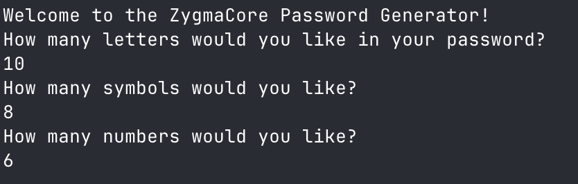
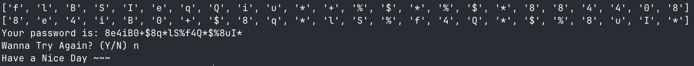

<h1 align="center">ZygmaCore Password Generator</h1>

<p align="center">
  
  
  
</p>

<p align="center">
  
</p>

<h3 align="center">
  A Python CLI tool that generates secure, customizable passwords using letters, numbers, and symbols.
</h3>

---

## 📘 About The Project

The **Password Generator** is a simple and interactive **Python CLI-based password generator**.  
It lets the user define:

- How many **letters**
- How many **symbols**
- How many **numbers**

The script then builds a randomized, secure password using those specifications.

Perfect for:

- Beginners learning loops, lists, and randomization  
- Quick password generation  
- A neat portfolio-ready CLI project  

---

### 💡 Why This Project Exists

A lot of password generator tutorials are too basic or not interactive.  
This project aims to create:

- A clean, straightforward password generator
- A customizable input system
- A shuffled, high-security output
- A replayable CLI experience  
- And a clear separation of letters, numbers, and symbols

It’s also a great foundation for building more advanced versions.

---

## 🖼 Screenshot



---

## 🛠 Tech Stack

| Technology | Usage |
|-----------|--------|
| 🐍 **Python** | Main programming language |
| 🔀 **random** | Select & shuffle characters |
| 💻 **CLI / Terminal** | User interaction |
| 🧹 **os** | Clears the screen for clean UI |

---

## ✨ Key Features

- 🔡 **Custom Letter Count**  
- 🔢 **Custom Number Count**  
- ✴️ **Custom Symbol Count**  
- 🎛️ **Fully Customizable Password Length**
- 🔀 **Random Shuffle for High Entropy**
- 🔁 **Replay Without Restarting the Program**
- 🧹 **Screen Clearing for Clean UX**
- ⚠️ **Simple Input Validation**

---

## 🚀 Getting Started

### ✅ Prerequisites

Make sure you have:

- Python **3.8+**
- Terminal or PowerShell

---

### 📦 Installation

Clone the repo:

```bash
git clone https://github.com/ZygmaCore/password-generator.git
cd password-generator
```

(Optional) Create virtual environment:

```bash
python -m venv .venv
# macOS/Linux
source .venv/bin/activate
# Windows
.venv\Scripts\activate
```

---

## ▶️ Usage

Run the script:

```bash
python password_generator.py
```

Example:

```
Welcome to the PyPassword Generator!
How many letters would you like in your password?
5
How many symbols would you like?
2
How many numbers would you like?
3
```

Sample Output:

```
['a', 'K', '%', '3', 'x', '7', '$', 'b', '1']
Your password is: aK%3x7$b1
```

---

## 🤝 Contributing

Contributions are always welcome!  
Want to add features like:

- Strength meter  
- Copy-to-clipboard  
- Colorized output  
- Preset “Strong / Ultra Strong” modes?  

Feel free to open a pull request 🚀

---

## 📄 License & Contact

This project is licensed under the **MIT License**.
See the `LICENSE` file for full details.

**Author Contact:**  
🌐 https://alhikam.me
🐙 https://github.com/ZygmaCore